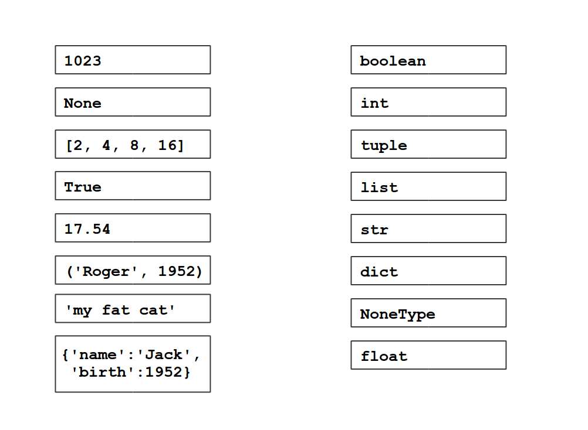

# Data Types Overview

## Data types

Match the data samples with their types.

# Definitions

## Immutable and mutable data types

In Python there are basic and composite data types. The values of basic data types cannot be changed, they are **immutable**. Most of the composite data types are **mutable**.

The immutable data types in Python are:

* Boolean (`True` / `False`)
* Integer (`0`, `1`, `-3`)
* Float (`1.0`, `-0.3`, `1.2345`)
* Strings (`'apple'`, `"banana"`) - both single and double quotes are valid
* None (aka an empty variable)
* Tuples (multiple values in parentheses, e.g. `('Jack', 'Smith', 1990)`)

The mutable data types are

* List [1, 2, 2, 3]
* Dictionary {'name': 'John Smith', 'year': 1990}
* Set ()

## Type conversions

Values can be converted into each other using *conversion functions*. Try the following:

    :::python
    int('5.5')
    float(5)
    str(5.5)
    list("ABC")
    tuple([1,2,3])
    dict([('A',1),('B',2)])
    set([1,2,2,3])
