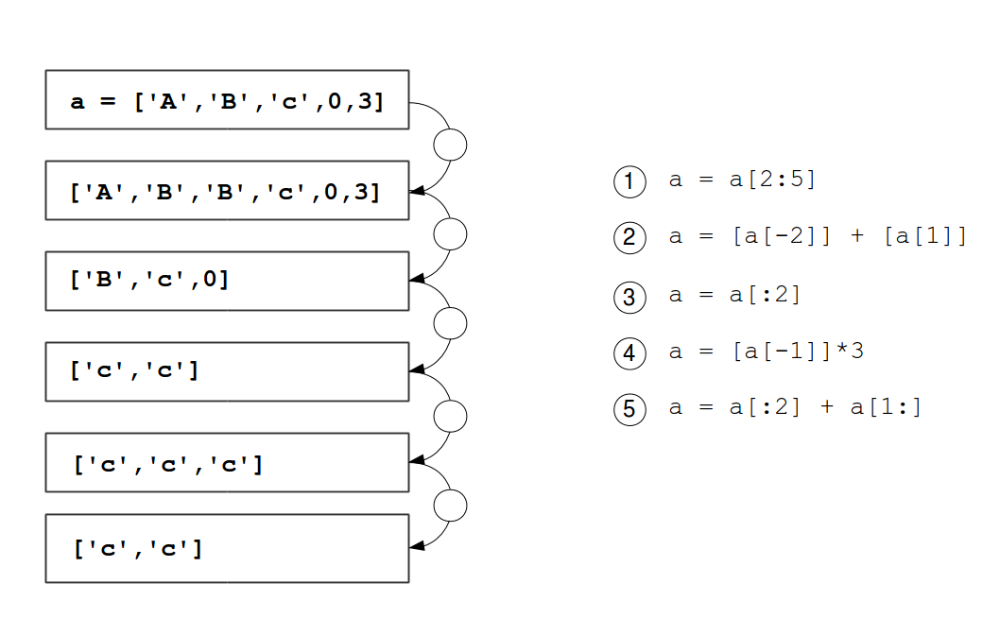

# Lists

In this chapter we will combine multiple values to a new data type: a **list**.

To process larger amounts of data, we cannot invent a new variable name for every entry (and write the code for it).
Somehow it has to be possible to store multiple data records in one variable.
This is where **lists** come in.

Lists are a simple sequence of elements.
However, Python is counting differently than humans:

----

### Exercise 1

Try a few commands for creating lists:

    :::python3
    numbers = [1, 2, 4, 8, 16, 32]
    numbers = numbers + [64, 128, 256]

    movies = ["Star Wars", "Star Trek", "Ratatouille"]
    movies += ["Arrival"]

Print the lists.

----

### Exercise 2: Indexing

What do the following commands result in?

    :::python3
    numbers[4]
    movies[0]
    movies[-1]
    numbers[-3]

----

### Exercise 3: Slicing

What do the following commands result in?

    :::python3
    movies[2:]
    movies[:2]
    numbers[2:-2]
    numbers[::2]

----

### Exercise 4: List syntax

Which instructions are correct?

* `data = ["Tilda", "Swinton"]`
* `data = ["Darth Vader" "Yoda"]`
* `data = [1, 2 + 3, 4]`
* `data = [1, 2] + [3, 4]`
* `data = [1, 2] + 3, 4]`
* `data = [1, 2.0, "three"]`

----

### Exercise 5: Loop over a list

What does the following program do?

    :::python3
    movies = ["Star Wars", "Star Trek", "Ratatouille"]
    for f in movies:
        print(f)

----

### Exercise 6: List methods

Find out what each of the expressions does to the list in the center.

----

### Exercise 7

Use the expressions to modify the list as indicated. Use each expression once.

----

### Exercise 8

Use the expressions to modify the list as indicated. Use each expression once.

---

### Exercise 9

Create a list that contains names of movies.

Write a `for` loop that iterates through the movie names.

Build a new list that contains only the first characters of each title.

For instance with the input:

    :::text
    Star Wars, Star Trek, Ratatouille

your program should output

    :::text
    S
    S
    R
