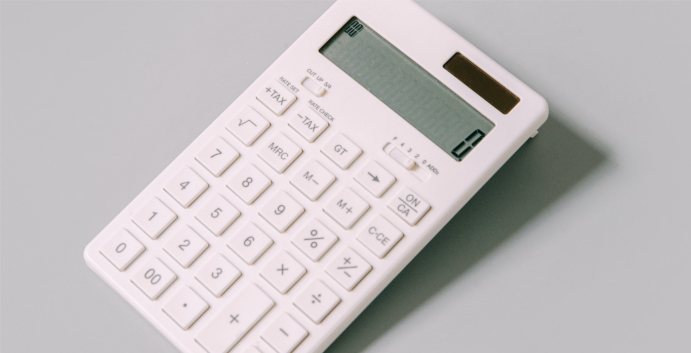

# Python as a Calculator

**🎯 Use Python for simple arithmetics.**

*[photograph by Charles Deluvio on Unsplash](https://unsplash.com/@charlesdeluvio)*

----

### In this chapter you will learn to:

| area | topic |
|---------|-------|
| 💼 | calculate with numbers |
| 💡 | use the data type *integer* |
| ⚙ | use arithmetical operators |
| ⚙ | store numbers in variables  |
| ⚙ | change the contenst of variables |
| 🔧 | use the Variablee Explorer |

----

## Arithmetics

In this chapter we will use the Python console as a pocket calculator.
In Spyder you should see the following prompt (in the bottom right window):

    :::python3
    In [1]:

If you see a different number than 1 it is still the right place.

----

### Exercise 1: Basic Arithmetics

Execute a few calculations in Python.
Insert the missing symbols into the gaps:

    :::python3
    In [1]: 1 + ___
    Out[1]: 3

    In [2]: 12 ___ 8
    Out[2]: 4

    In [3]: ___ * 5
    Out[3]: 20

    In [4]: 21 / 7
    Out[4]: ___

    In [5]: ___ ** 2
    Out[5]: 81

Enter the commands into the console and see what happens.

Do not enter the first part (`In [1]` etc.). It appears automatically.

----

### Exercise 2: Division

What is the difference between the following instructions?

    :::python3
    10 / 4
    10.0 / 4
    10 // 4
    10 * 0.25

Enter them in the console and examine the result.

----

### Exercise 3: More Operators

Which operations result in 8?

    :::python3
    4 - -4
    65 // 8
    17 % 9
    64 ** 0.5

Enter the instructions and examine the result.

----

### Exercise 4: Variables

For saving numbers and results of calculations for later, you can store them in **variables**.

Fill the gaps:

    :::python3
    In [1]: apples = 25
    In [2]: bananas = 7
    In [3]: cherries = 5
    In [4]: apples
    Out[4]: ______
    In [5]: bananas + 1
    Out[5]: ______
    In [6]: 3 * cherries
    Out[6]: ______

----

### Exercise 5: Modify Variables

The first instruction modifies the value of a variable from exercise 4.
Insert values and variables so that the result is correct:

    :::python3
    In [7]: apples = apples + 1
    In [8]: apples
    Out[8]: _____

    In [9]: fruit = _____ + _____ + _____
    In [10]: fruit
    Out[10]: 38

In the **Variable Explorer** in Spyder (top right) you can inspect the content of each variable.

----

### Exercise 6: Assignments

Which variable assignmments are correct?

    :::python3
    a = 1 * 2
    2 = 1 + 1
    5 + 6 = y
    seven = 3 * 4

----

### Exercise 7: White Rabbits

In April you have 10 white rabbits:

    :::python3
    rabbits = 10

The rabbits constantly multiply.
Every month, their number grows by 20%. In May you already have 12 rabbits.

**How many rabbits will you have in December?**

#### Hints:

- assume that rabbits never die
- it is OK to calculate with fractions of rabbits
- it is OK to copy the same line(s) multiple times for each month
