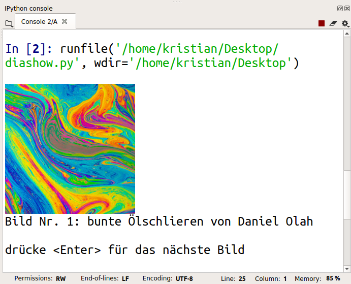

# Slideshow

**🎯 Program a small slideshow.**

*Example output*

----

## In this chapter you will learn to:

| area | topic |
|---------|-------|
| 💼 | display images |
| 💡 | use the Pillow library |
| 💡 | manipulate images with Pillow |
| ⚙ | import modules |
| ⚙ | write file names and file paths |
| ⚙ | iterate over a list |
| ⚙ | index a list |
| 🔀 | use a counter variable |

----

### Exercise 1: Display an image

Use the **Pillow** library to display images in Spyder:

* download the [zipfile with 10 images](/static/content/python_basics_DE/10bilder.zip).
* unzip the file
* copy the image `"rainbow.jpg"` into your folder with Python programs.

Create a new program file with the following instructions:

    :::python3
    from PIL import Image
    from IPython.display import display

    pic = Image.open('rainbow.jpg')
    display(pic)

Save the program in the same folder as the image and execute it.
In Spyder, you should see the image in the **Python Console** at the bottom right.

If you see an error message, the image is probably stored somewhere else.
Please check that it is in the same folder in which you saved the Python code.

If you don't see anything (e.g. because you are using a different editor), replace the `display()` command by:

    :::python3
    pic.show()

----

### Exercise 2: Paths

Next, we will read an image froma different folder.

Move the entire ordner with 10 images into your folder with Python programs.

Define a variable that contains the name of the folder (also called a *"path"*):

    :::python3
    from PIL import Image
    from IPython.display import display

    path = 'images/'
    pic = Image.open(path + 'flower.jpg')
    display(pic)

The *forward slash* is very important to separate names of folders and files from each other.
Python is very picky about whether you use a forward slah (`/`) or backslash (`\`).

If you see an error message, it is likely that the images are probably somewhere else (the image folder and your program are in different folders).

----

### Exercise 3: Multiple images

Create a list with names of images:

    :::python3
    images = ['rainbow.jpg', 'flower.jpg', 'pebbles.jpg']
    for filename in images:
        pic = Image.open(path + filename)
        display(pic)

Add the following instruction to the program:

    :::python3
    input('press <Enter> for the next image')

Where do you need to insert the command to see the next image?

----

### Exercise 4: Number the images

Now every picture should get a number.
For that we use a **counter variable**.

The counter increases by one in every round of the `for` loop, so that it contains the number of the current image all the time.

Add the following instructions to the program from the previous exercise. Find out which line needs to go where:

    :::python3
    print(title)
    i = i + 1
    i = 0
    title = f"Image No. {i}"

If everything is done correctly, you should see a caption with the right number below each image, e.g.:

    :::text
    Image No. 1

----

### Exercise 5: Captions

Prepare a list of image captions e.g.:

captions =  [
        'oil reflections by Daniel Olah',
        'white flower by Annie Spratt',
        'pebbles by John Salzarulo'
        ]

We would like to print one caption at a time.
We will use **indexing** for that.
Check what output the following instructions produce:

    print(captions[0])

    print(captions[2])

Insert the variable `i` from the previous exercise into the square bracket to output the right caption for an image, e.g.:

    :::text
    Image No. 1
    oil reflections by Daniel Olah

----

### Exercise 6: Manipulating images

The **Pillow** library can do a lot more!
Try the following instructions one by one to find out what they do:

    :::python3
    x, y = pic.size
    print(x, y)

    b = pic.resize((500, 500))
    display(b)

    b = pic.rotate(45)
    display(b)

    b = pic.crop((100, 100, 300, 300))
    display(b)

    pic.save('neues_bild.png')

There is a very, very detailed documentation of Pillow on [pillow.readthedocs.io](https://pillow.readthedocs.io).

----

### Exercise 7: Your own images

Use your own images and label them.

To suppress the last input, you could modify the `input()`-command:

    :::python3
    if i < len(images):
        input('next image')

Present your slide show.

**Tip:** *If you want to present larger images, use the mouse to drag the border of the output window in Spyder and make it bigger.*

----

## Image sources

The following images were taken from [unsplash.com](https://unsplash.com):

* Bubbles by Marko Blažević on Unsplash
* Coffee by Nathan Dumlao on Unsplash
* Ivy by asoggetti on Unsplash
* Orange by Vino Li on Unsplash
* Rainbow paint by Daniel Olah on Unsplash
* Pebbles by John Salzarulo on Unsplash
* Waterfall by Ben Guerin on Unsplash
* Clouds by Zbynek Burival on Unsplash
* White flower by Annie Spratt on Unsplash
* Puddle by Erik Mclean on Unsplash
