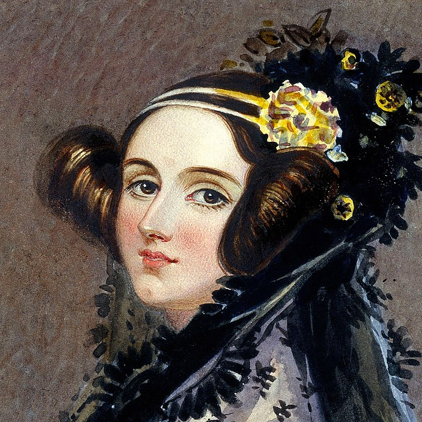

# Ada Lovelace

**🎯 Calculate the age of Ada Lovelace, the first programmer.**

[Ada Lovelace, image by Alfred Edward Chalon - Biography.com, public domain](https://commons.wikimedia.org/w/index.php?curid=25519820)

----

## In this chapter you will learn to:

| area    | topic |
|---------|-------|
| ⚙ | distinguish data types |
| 💡 | use the data type `float` |
| 💡 | convert data types |
| 🐞 | recognize bugs at runtime |

----

Python contains many functions for **type conversion**.

With the functions `int()`, `float()` and `str()` you can convert numbers and strings into each other.

----

### Exercise 1: Ada Lovelace

Insert the following pieces into the gaps, so that all instructions are executed correctly: `age`, `int(age)`, `name`, `str(born)`, `1815`

    :::python3
    name = "Ada Lovelace"
    born = _____
    ____ = "37"

    text = ____ + " was born in the year " + _____ + "."
    year = born + _____
    print(text)
    print(year)

----

### Exercise 2: Nine plus nine

Insert `int()` or `str()` into the instructions, so that all of them run without an error.

    :::python3
    9 + 9
    9 + '9'
    '9' + '9'
    9 * '9'

----

### Exercise 3: Output

Which `print` statements work?

    :::python3
    print("9" + "9")
    print "nine"
    print(str(9) + "nine")
    print(9 + 9)
    print(9 + int("9"))
    print(nine)
    print(float("9") + int(9.0))

----

### Exercise 4: Debugging

The following code should calculate the age of Ada in a year entered by the user.
It contains three bugs.
Find and fix them.

    :::python3
    year_of_birth = 1815
    year = input('Which year is it? ')
    age = year_of_birth - year

    print("Today, Ada Lovelace would be " + age + " years old.")    
