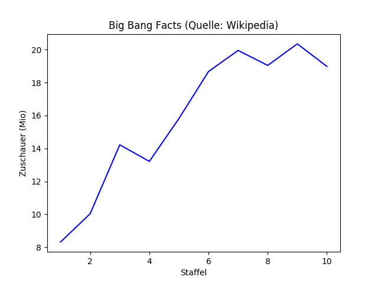

# Create a Time Series

## In this chapter you learn:

| Bereich | Thema |
|---------|-------|
| 💼 | creating a time series |
| 🔀 | read multiple files |
| 🔀 | fill gaps in data |
| ⚙ | the `break` statement |
| 💡 | the `os` module |
| 🐞 | executing programs partially |

----

In this chapter you will examine how the frequency of a name develops over time.
That will require us to read not *one* but *all* files from the babynames dataset.

----

### Exercise 1

Use the `range()` function to create lists of numbers.
The `list()` function converts the objects from `range()` into lists:

    :::python3
    list(range(10))
    list(range(10, 20))
    list(range(10, 100, 10))
    list(range(20, 0, -2))

Create a list with the years **`[1880, 1881, 1882, ... 2015]`**.

----

### Exercise 2

Create a list of file names that look like this:

    :::python3
    ['yob1880.txt', 'yob1881.txt', ... 'yob2015.txt']

----

### Exercise 3

The following code calculates the total number of US births from the last 130 years.

In the program there are multiple *semantic errors*.
Execute the code and inspect the output.
Find and repair the defect.

    :::python3
    for year in range(1890, 2015, 1):
        total = 0
        filename = f"names/yob{year}.txt"
        for row in open(filename):
            columns = row.strip().split(',')
        total += sum(int(columns[2]))

    print(f"\nResult: {total} births")

----

### Exercise 4

Write a program that identifies and prints rows containing your name in the years 1880 to 2014.

----

### Exercise 5

Extend the program so that it also checks for the gender.
Output rows that match `'M'` or `'F'`.

----

### Exercise 6

Collect the number of births with your name for each year in a list.

----

### Exercise 7

If no match was found, add a `0` to the list.

* before reading a file, set a variable `number` to `0`
* if you find your name, modify the contents of this variable
* after processing a file, add the value of `number` to the list of results

----

### Exercise 8

Execute the following code to draw a line plot:

    :::python3
    from matplotlib import pyplot as plt

    plt.figure()

    x = list(range(1, 11))
    y = [8.31, 10.03, 14.22, 13.21, 15.82,
         18.68, 19.96, 19.05, 20.36, 18.99]

    plt.plot(x, y, 'b-')

    plt.title('Big Bang Facts (Source: Wikipedia)')
    plt.xlabel('Season')
    plt.ylabel('Spectators (mil)')

----

### Exercise 9

Modify the code so that it outputs the frequency of your name.

----

### Exercise 10

Plot the time line of Probiere prominente Namen aus und plotte deren Zeitreihe (Tips: *Madonna, Luke Skywalker, Harley Davidson, Tyrion Lannister, Khaleesi, Sheldon*)

Du kannst die Funktion `plot()` mehrmals aufrufen und so mehrere Linien im gleichen Diagramm erzeugen.
